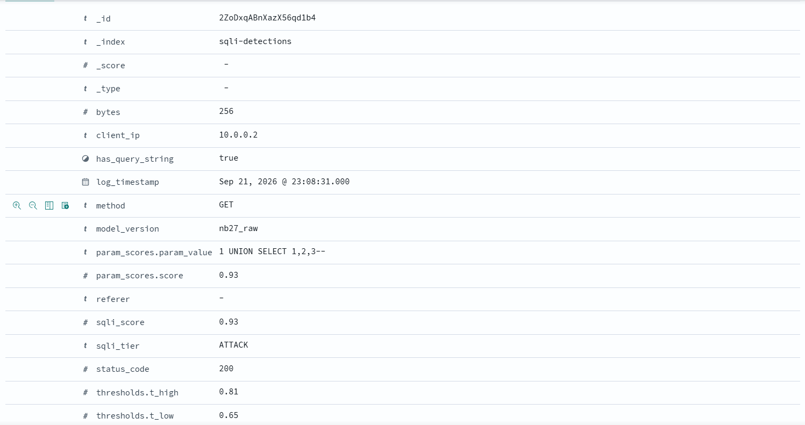

# QPRA SQL Injection Detection Pipeline

Reproducibility and deployment code for the SQL injection detector described in:

**Reducing False Positives in Real-Traffic SQL Injection Detection via Query-Parameter Representation Alignment**  
IEEE DASC 2026 — Muhammed Torkey and Jawad Manzoor

Repository: `mohtork/sqli-query-parameter-representation-alignment`

## Scope

This repository contains **only the SQL injection (SQLi) detector**. XSS, RCE/command-injection, path-traversal, and other detectors from the broader prototype have been removed so that the repository corresponds directly to the paper.

The deployed SQLi path is:

```text
Apache/Nginx access log
        |
     Filebeat
        |
      Kafka
        |
  SQLi consumer
        |
  QPRA extraction
(query parameter values)
        |
char 1-3 grams + 17 symbol-count features
        |
   NB27 Random Forest
        |
per-parameter max-score aggregation
        |
ATTACK / SUSPICIOUS / BENIGN
        |
    OpenSearch
```

## Query-Parameter Representation Alignment (QPRA)

The model does not score the whole URL. It URL-decodes and isolates each query-parameter value, scores each value independently, and uses the maximum SQLi probability as the request score.

Example:

```text
/product?id=1%20AND%20SLEEP(5)--&category=shoes
```

becomes:

```text
["1 AND SLEEP(5)--", "shoes"]
```

Each value is scored separately and the maximum probability drives the three-tier policy.

## Model artefacts

The `models/` directory contains the NB27 SQLi artefacts used by the consumer:

```text
models/
├── 27_rf_raw.joblib
├── 27_vectorizer.joblib
└── sqli_detector_config.json
```

Configuration:

- character n-grams: 1-3
- structural features: 17 SQL-oriented symbol counts
- Random Forest: 100 trees (`random_state=42`)
- serialized with scikit-learn 1.6.0
- `T_LOW = 0.65`
- `T_HIGH = 0.81`
- request aggregation: maximum per-parameter SQLi probability

> **Security note:** Joblib files are Python pickle-based artefacts. Load model files only from a trusted source.

## Dataset provenance

The initial SQLi training corpus used in the paper is the **Sajid576 SQL Injection Dataset**:

https://www.kaggle.com/datasets/sajid576/sql-injection-dataset

CSIC 2010, AIT-LDS-v1.1, and Zanbil.ir were used for development/evaluation and were not intentionally added to the RF training corpus. The real production Nginx access log used in the paper is not redistributed because it contains real website traffic.

## Project structure

```text
.
├── .env.example
├── .gitignore
├── README.md
├── MODEL_CARD.md
├── CITATION.cff
├── SECURITY_AND_DATA.md
├── score_url.py
├── docker-compose.yml
├── test_producer.py
├── configuration/
│   └── filebeat.yml
├── consumer/
│   ├── Dockerfile
│   ├── main.py
│   ├── pipeline.py
│   ├── requirements.txt
│   └── detectors/
│       ├── __init__.py
│       ├── base.py
│       └── sqli.py
├── models/
│   ├── 27_rf_raw.joblib
│   ├── 27_vectorizer.joblib
│   └── sqli_detector_config.json
└── tests/
    └── test_detector.py
```

## Local scoring without the full stack

After installing the consumer requirements:

```bash
python -m pip install -r consumer/requirements.txt
python score_url.py "/page?id=1%20AND%20SLEEP(5)--"
```

This loads the same NB27 vectorizer and RF artefacts used by the containerized consumer.

## Quick start

### 1. Create the runtime environment file

```bash
cp .env.example .env
```

### 2. Start Kafka, OpenSearch, Dashboards, and the SQLi consumer

```bash
docker compose up -d --build
```

OpenSearch Dashboards is available at:

```text
http://localhost:5601
```

### 3. Send sample SQLi and benign events

Install the small producer dependency locally if needed:

```bash
python -m pip install kafka-python==2.0.2
python test_producer.py
```

### 4. Inspect indexed results

```bash
curl 'http://localhost:9200/sqli-detections/_search?pretty'
```

To show only alerts:

```bash
curl 'http://localhost:9200/sqli-detections/_search?pretty' \
  -H 'Content-Type: application/json' \
  -d '{"query":{"terms":{"sqli_tier.keyword":["ATTACK","SUSPICIOUS"]}}}'
```

### End-to-end detection example

The following example shows an SQL injection request processed by the containerized pipeline and indexed in OpenSearch.

The query-parameter value:

```text
1 UNION SELECT 1,2,3--
```

was scored independently by the NB27 SQLi detector using QPRA. The resulting SQLi probability was `0.93`, exceeding the configured `T_HIGH = 0.81` threshold and producing an `ATTACK` classification.



The indexed document also records the model version, per-parameter score, request-level SQLi score, classification tier, and thresholds used for the decision. This demonstrates the complete path from request processing and QPRA scoring to the final OpenSearch detection record.

## Indexing modes

Set `INDEX_MODE` in `.env`:

| Mode | Behaviour |
|---|---|
| `all` | Index all parsed requests, including `NO_QS` |
| `scored` | Index requests with query parameters; skip `NO_QS` |
| `no_qs` | Alias of `scored` |
| `alerts_only` | Index only `ATTACK` and `SUSPICIOUS` |

## Web-server request bodies

This detector operates on URL query parameters available in standard access logs. Apache and Nginx do not record HTTP request bodies in normal access logs by default. Indiscriminate request-body logging may expose credentials, personal information, and other sensitive data, so request-body logging is not required by this deployment architecture.

## Run the smoke tests

```bash
python -m pip install -r consumer/requirements.txt
pytest -q
```

## Filebeat

`configuration/filebeat.yml` is an example for forwarding raw access-log lines to Kafka. Update the log path and Kafka host for your environment.

## Reproducibility note

The public repository can include the source code, model artefacts, configuration, and public-dataset preparation/evaluation code. Do **not** publish raw production access logs containing real user traffic. Use sanitized examples or derived aggregate results where necessary.

## Experimental notebooks

The `notebooks/` directory contains the principal experimental notebooks used
during development and evaluation of the SQLi detector.

| Notebook | Purpose |
|---|---|
| `01_sqli_detector_training.ipynb` | Initial Random Forest training and baseline evaluation |
| `02_ml_inference_evaluation.ipynb` | Baseline inference evaluation and representation-mismatch analysis |
| `03_retrained_way3.ipynb` | Query-parameter representation alignment (QPRA) experiment |
| `04_way3_evaluation.ipynb` | QPRA evaluation on real traffic |
| `05_decision_policy.ipynb` | SQLi thresholds and three-tier decision policy |
| `06_real_log_testing.ipynb` | Production-log evaluation |
| `07_retrained_augmented_v2.ipynb` | Augmented RF retraining experiment |
| `08_ait_lds_evaluation.ipynb` | Cross-dataset evaluation using AIT-LDS |
| `09_zanbil_evaluation.ipynb` | Cross-dataset evaluation using Zanbil |
| `11_csic2010_pipeline_evaluation_updated.ipynb` | CSIC pipeline and per-parameter aggregation evaluation |
| `17_mobilebert_sqli_only_ec2.ipynb` | SQLi-specific MobileBERT evaluation |
| `18_rf_sqli_only_ec2.ipynb` | RF representation ablation on CSIC |
| `19_pipeline_rf_vs_mobilebert.ipynb` | Pipeline-level RF and MobileBERT comparison |
| `27_rf_balanced_augmentation.ipynb` | Final NB27 balanced-augmentation and regression-gated RF experiment |

### Experimental roles

These notebooks represent different stages of model development and evaluation
and should not all be interpreted as independent final-test experiments.

The **Sajid576 SQL Injection Dataset** is the source dataset used for initial
Random Forest training. CSIC 2010 was not used to train the Random Forest or
fit its vectorizer; it was repeatedly used as a controlled
development/evaluation benchmark. AIT-LDS and Zanbil were used for
cross-dataset evaluation.

The final model artefacts distributed in `models/` correspond to the NB27
experiment in `27_rf_balanced_augmentation.ipynb`.

The production Nginx access logs used in the experiments are not distributed
because they contain genuine website traffic. Where appropriate, notebook
outputs containing production-log samples have been removed while aggregate
experimental results are retained.